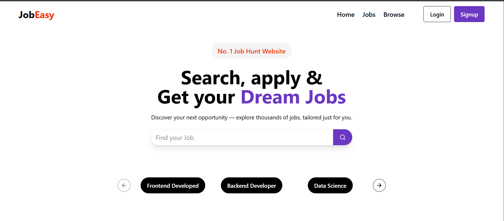
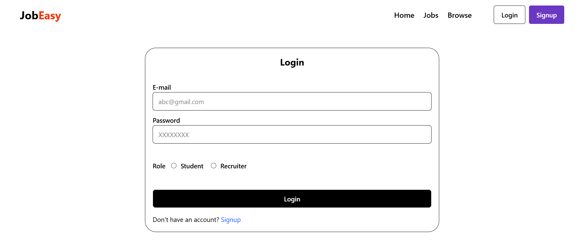
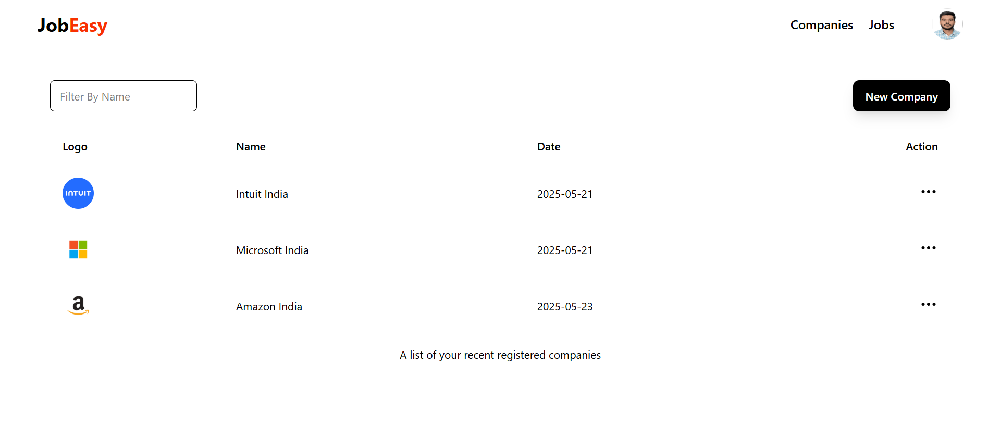

# 💼 JobEasy

JobEasy is a full-stack Job Portal built using the MERN stack (MongoDB, Express.js, React.js, Node.js). It supports job seekers and recruiters, providing seamless login/signup, job posting, job applications, resume uploads (via GoFile), and a clean user experience.

## 🌐 Live Demo

- **Frontend (React + TailwindCSS)**: [https://jobeasy-frontend.onrender.com](https://jobeasy-frontend.onrender.com)
- **Backend (Node.js + Express)**: [https://jobeasy-ouf0.onrender.com](https://jobeasy-ouf0.onrender.com)

---

## 📸 Screenshots

### 1. Home Page


### 2. Login Page


### 3. Recruiter Dashboard


### 4. Resume Upload


---

## 🚀 Features

- 👤 Role-based authentication (`Job Seeker` and `Recruiter`)
- 🔐 JWT Auth using cookies (with `httpOnly`, `secure`, `SameSite=None`)
- 🧾 Resume Upload via GoFile API
- 📋 Job Posting and Browsing
- 🔍 Keyword-based job search
- 💬 Responsive UI with TailwindCSS
- ☁️ Deployed on Render (Free Hosting)

---

## 🧑‍💻 Tech Stack

- **Frontend:** React, TailwindCSS, Redux Toolkit, Axios
- **Backend:** Node.js, Express.js, MongoDB, Mongoose
- **Auth:** JWT with cookies
- **Hosting:** Render
- **Profile upload:** cloudinary
  
---
## 🏗️ Folder Structure

```
JobEasy/
│
├── frontend/               # React frontend
│   ├── public/
│   └── src/
│       ├── components/
│       ├── hooks/
│       ├── redux/
│       └── App.jsx
│
├── backend/                # Node.js backend
    ├── controllers/
    ├── middlewares/
    ├── models/
    ├── routes/
    ├── utils/
    └── index.js
```

## ⚙️ Installation

### Backend Setup

```bash
cd backend
npm install
```
# Create a .env file with:
#### MONGODB_URI=
#### SECRET_KEY=
#### SECRET_KEY=
#### CLOUD_NAME=
#### API_KEY=
#### API_SECRET=

```bash
npm run dev
```

### Frontend Setup
```bash
cd frontend
npm install
npm run dev
```


